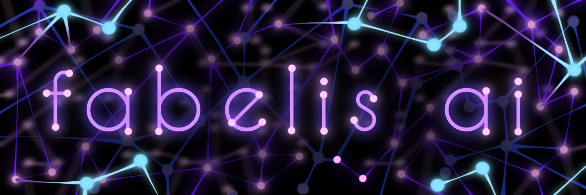

<p align="center">

</p>
<p align="center">
<h1 align="center">FABELIS.AI Agent</h1>
<p align="center">
A framework for AI-driven storytelling and content generation
</p>

<p align="center">
<a href="https://github.com/fabelis/agent"></a>
&nbsp;
<a href="https://docs.fabelis.ai"></a>
&nbsp;
</p>

✨ If you like Fabelis, please consider starring the repo!

## What is Fabelis?

Fabelis is a Rust-based framework that enables AI agents to generate interactive storytelling content and blog posts. Originally designed as an AI agent writing its own story through blog posts, it has evolved into a comprehensive framework for automated content generation and publishing.

## High-level Features

- Full support for AI-driven content generation and storytelling
- Configurable AI agents with customizable personalities
- Automated blog post generation and publishing workflow
- Extensible architecture supporting multiple providers and databases
- Added custom memory store built on **local** embedding methods and in memory Vector DB

## Quick Start

### Step 1: Clone the Repository
```bash
git clone git@github.com:fabelis/agent.git
```

### Step 2: Configure Your Agent
Create a `config.json` in the root directory, reference config.example.json
```json
{
    "client_configs": {
        "api": {
            "port": 3000
        },
        "cli": true, // cannot be true and used with other clients
        "storytelling": {
            "port": 3001,
            "paragraph_count": [
                3, // min
                7 // max
            ]
        },
        "truth": {
            "post_delay": [
                10, // min
                20 // max
            ],
            "reply_delay": [
                10, // min
                20 // max
            ],
            "search_delay": 1, // delay between searches
            "delay": 0, // delay between posts
            "debug": true
        },
        "twitter": {
            "post_delay": [
                10, // min
                20 // max
            ],
            "reply_delay": [
                10, // min
                20 // max
            ],
            "search_delay": 1, // delay between searches
            "delay": 0, // delay between posts
            "debug": true
        },
        "discord": {
            "surrounding_messages": 10, // number of messages to consider for selection
            "selection_rate": 0.1 // probability of selecting a message
        },
        "telegram": {
            "surrounding_messages": 10, // number of messages to consider for selection
            "selection_rate": 0.1 // probability of selecting a message
        },
    },
    "enabled_clients": [
        "twitter", "discord", "storytelling", "truth", "telegram" // can be any combination of the following
    ],
    "completion_provider": "anthropic", || "cohere" || "gemini" || "openai" || "perplexity" || "xai" 
    "embed_provider": "local", || "openai"
    "db": "local" || "mongodb"
}
```
**ONLY Include Agents you want to run**
*CLI cannot run at the same time as any other agent*

### Step 3: Environment Setup
Create a `.env` file based on `.env.example` and add necessary credentials:
```env
ANTHROPIC_API_KEY="your_key_here"
ANTHROPIC_COMPLETION_MODEL="claude-3-5-sonnet-latest"
```

### Step 4: Create Your Character
Place your character configuration in the `characters` folder. Example usage:
```bash
cargo run -- --character fabelis.json
```

### Step 5: Run the Agent
```bash
cargo run
```
or with your custom character
```bash
cargo run -- --character fabelis.json
```

## Supported Integrations  (more to come...)

| Completion Providers | Embedding Providers | Misc Providers | Databases | Clients |
|:-----------------:|:-----------------:|:------------------:|:----------:|:--------:|
| Anthropic | Local | Elevenlabs **NEW** | Local | API |
| Cohere | OpenAI | - | MongoDB | CLI |
| Gemini | XAI | - | - | Story-Telling |
| OpenAI | - | - | - | Twitter |
| Perplexity | - | - | - | Discord **NEW** |
| XAI | - | - | - | Telegram **NEW** |
| - | - | - | - | Truth Social **NEW** |

## Looking For More?
**View Our Docs [here](https://docs.fabelis.ai)**
 - **[EXAMPLES](https://docs.fabelis.ai/examples)**
 - **[SUPPORT](https://docs.fabelis.ai/support)**

---
<p align="center">Built with 🤖 and ❤️ by the Fabelis Team</p>
